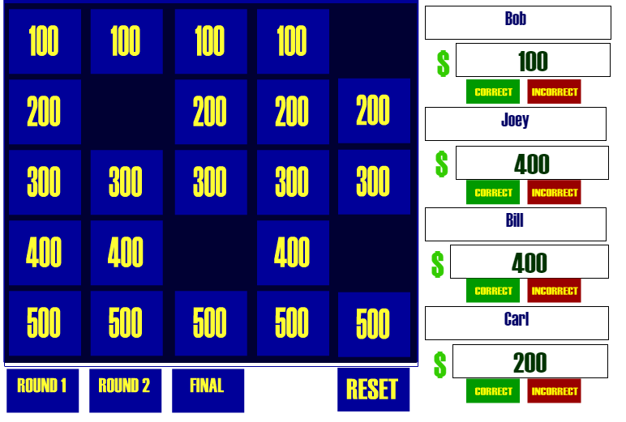

# Jeopardy
Flash is being deprecated. Your best chance of seeing this repo in action are to launch board2.html in Chrome. Variables no longer load from the text file.

## Preview

## About
Create your own Jeopardy game using Flash
To use this, just download it all and run Board2.html
The first few screens are for setting up the game (contestants don't watch!)
Questions/Answers were intended to be stored in variables.txt file so that they could be preloaded. It used to work, but with Flash being deprecated soon, I may rebuild this someday (when I have free time ha!) in another medium.

## Future
There are no plans to continue work on this project as is using this environment, however an updated version utilizing a better skeleton would be interesting

